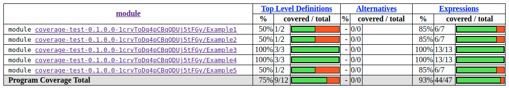
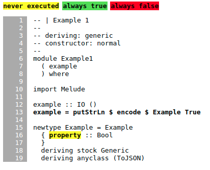
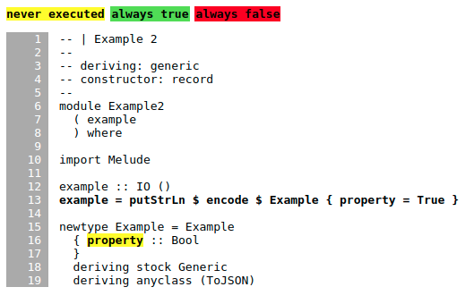
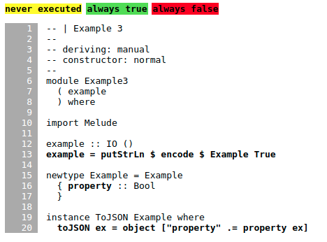
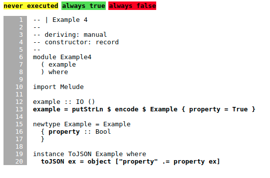
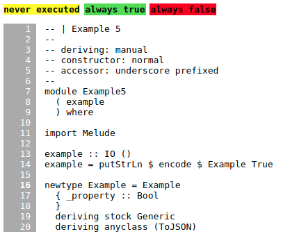

# Aeson Test Coverage Noise

These tests reveal ways in which `hpc` coverage is affected by noise from
different methods of `ToJSON` deriving and invocation.

## Example 1 (50% reported)

## Example 2 (50% reported)

## Example 3 (100% reported)

## Example 4 (100% reported)

## Example 5 (50% reported)

note: This example shows up with 50% coverage, but the `_property` is not highlighted.

