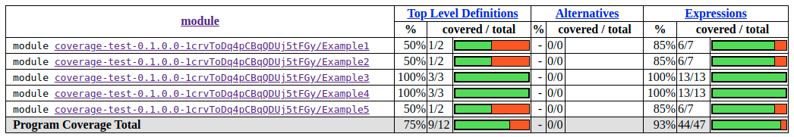
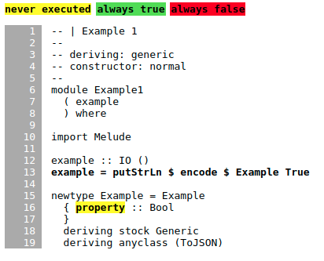
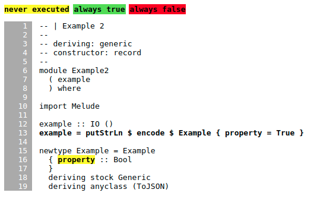
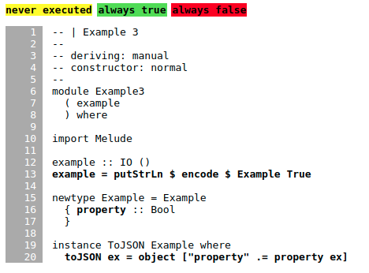
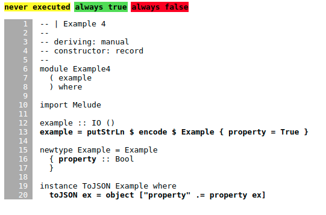
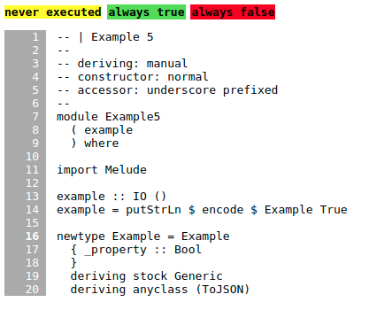

# Aeson Test Coverage Noise

These tests reveal ways in which `hpc` coverage is affected by noise from
different methods of `ToJSON` deriving and invocation.

## Example 1

## Example 2

## Example 3

## Example 4

## Example 5

